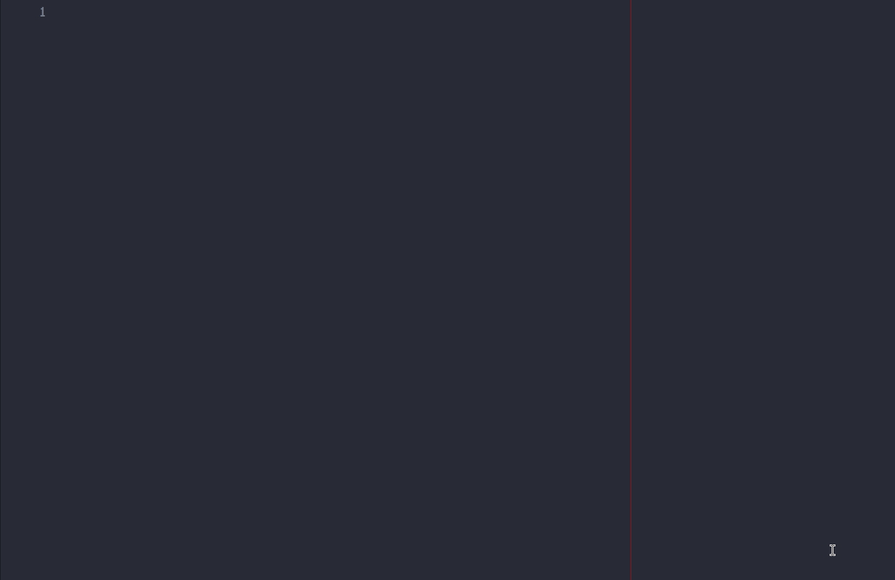

# 🔥 NodeJS Quick Snippets 🔥

> Make your life easier as a node developer, using the main daily snippets for repetitive code, it also includes DDD infrastructure snippets ENJOY !!.

  

## Features

> **FUNCTIONS SNIPPETS**

|       **Snippets**        |            **Description**            |
| :-----------------------: | :-----------------------------------: |
|     `@afn, @node_afn`     |   Add a JavaScript arrow function.    |
|      `@fn, @node_fn`      |      Add a JavaScript function.       |
|    `@afn, @node_aafn`     | Add a JavaScript async arrow fuction. |
| `@asyncfn, @node_asyncfn` |   Add a JavaScript async function.    |

> **TESTS SNIPPETS**

|    **Snippets**     |            **Description**             |
| :-----------------: | :------------------------------------: |
|   `@td, @node_td`   |     Add Jest Description function      |
|  `@tit, @node_tit`  |         Add Jest "it" function         |
| `@test, @node_test` | Add Jest Complete Description skeleton |

> **JOI SCHEMA SNIPPET**

|   **Snippets**    |     **Description**     |
| :---------------: | :---------------------: |
| `@joi, @node_joi` | Add Joi schema skeleton |

> **OPERATION SNIPPET**

|  **Snippets**   |          **Description**           |
| :-------------: | :--------------------------------: |
| `@op, @node_op` | Add an operation function skeleton |

> **REPOSITORY SNIPPET**

|    **Snippets**     |          **Description**           |
| :-----------------: | :--------------------------------: |
| `@repo, @nde_repo"` | Add a repository function skeleton |

  

## Release Notes

- **Version 1.0.1**

---

**⭐⭐ Enjoy! ⭐⭐**
